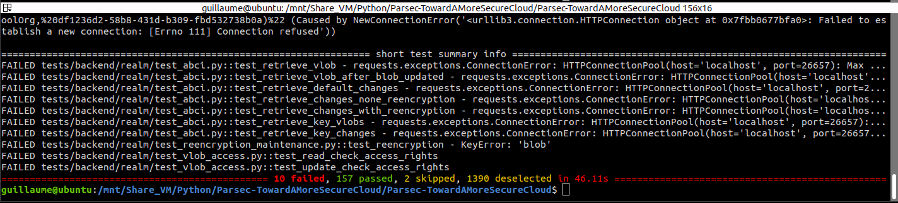

Second iteration : Verifiable history of metadata in Parsec with the technic of the ghost blockchain
====================================================================================================
For the second iteration of the internship (called the first iteration and implemented in the branch parsec-with-blockchain), we implement the technique describe in ``https://www.usenix.org/conference/nsdi20/presentation/hu-yuncong`` which we call the ghost blockchain (a blockchain running in parallel of Parsec). It aims at considering the backend as malicious instead of honest-but-curious. A specific protocol, call the protocol of the end epoch, is executed periodically. Thanks to this protocol, an alert is raised on the client side if an attack has occured on the history of the metadata. The idea is that each operation perform by the client are store by themselve, then each client request the history of metadata to the server and they check that the history received from the server is consistent with their own local stored operations.

Furthermore, the result of the internhip have been published on Scille's website, the company that develop and maintain Parsec: ``https://parsec.cloud/en/la-blockchain-au-service-du-stockage-cloud-securise/``.

Launch unit test using terminal
-------------------------------
``$ ./execute_unit_test.sh``

Perform test using gui
----------------------
Test with gui do not work, the internship was too short to implement it.

Summary result of unit test
---------------------------
Check that more than 157 tests out of 167 have been validated. Note that the 7 unit test related to ABCI fails because in the second iteration, we used a mockup blockchain instead of the "real" tendermint within its executable. Unit test related to ABCI work when the executable is used but not when mockup blockchain is used. Also, we add our own unit test to test the verifiable history we have implemented.

